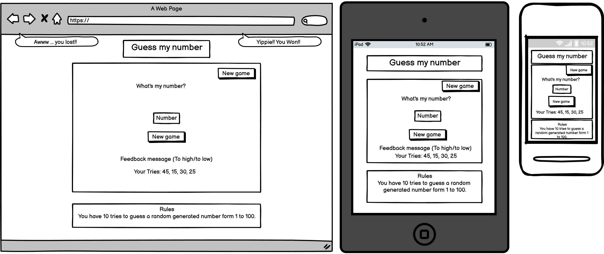

# Guess my number

**Guess my number** is a simple casual game. Almost anyone with access to a device will be able to play it. The player has 10 tries to guess a randomly generated number form 1 to 100. After the initial guess, the player will get a feedback to find the number "you guess is lower/higher then my number". 

Have fun!!

A live version of the game will be here: 

## Table of contents
1. [UX](#UX)
    - [User Stories](#User-stories)
    - [Wireframes](#Wireframes)
    - [Surface](#Surface)
2. [Features](#Features)
    - [Existing Features](#Existing-Features) 
        - [Header](#Header)
        - [Game area](#Game-area)
        - [Feedback area](#Feedback-area)
        - [The footer](#The-footer)
        - [Feature 5](#Feature-5)
        - [404 error page](#404-error-page)
    - [Future Features](#Future-Features)
3. [Technologies Used](#Technologies-Used)
4. [Testing](#Testing)
5. [Deployment](#Deployment)
6. [Credits](#Credits)

## UX
In this section you'll find elements of UX process.

### User Stories

#### As a website owner
- I want a simple, casual and easy to play game
- I want my users to be able to play the game intuitively and easily

#### As a user
- I want a fun and simple game to play
- I want to be able to play the game with my keyboard
- I want to be able to see my score as I play the game
- I want to be able to play the game on any device 

[Back to top](#Table-of-contents)

### Wireframes

[Back to top](#Table-of-contents)

### Surface

## Features

### Existing Features

### - Header
 - The header contains the title of the game and is positioned at the top of the page. The title clearly explains what the website is about.

### - Game area
 - This is the place where the user can play the game and it contains a input box and a submit button ("your guess").
 - A random number is generated.
 - In the input box, the user can enter a number. The number is checked to be between 1 and 100 and if it's valid, is checked against the random number. 
 - The user has 10 tries to guess the number.

### - Feedback area
 - This is the area that helps the user to find the right number.
 - Every time the user submits a number with "your guess" button, a "to high" or "too low" message is generated. 
 - User's number is stored below feedback message.

### - The footer
 - The footer contains the rules of the game and it's positioned at the bottom of the page.

### - 404 error page
 - A 404 error page was created to give users some feedback when they try to reach a non-existent page on this website.

### Future Features

[Back to top](#Table-of-contents)

## Technologies Used

1. [HTML](https://en.wikipedia.org/wiki/HTML) - Programming language used for website structure and content
1. [CSS](https://en.wikipedia.org/wiki/CSS) - Programming language used for styling website
1. [javascript](https://www.javascript.com/) - Programming language used to create user interaction
1. [Balsamiq](https://balsamiq.com/) - Used to create wireframes
1. [Gitpod](https://www.gitpod.io/) - IDE (Integrated Development Environment), for writing, editing and saving code
1. [GitHub](https://github.com/) - Code repository hosting platform
1. [Chrome DevTools](https://developer.chrome.com/docs/devtools/) - Chrome's built in web developer tools

[Back to top](#Table-of-contents)

## Testing

## Deployment

This section describes the process of deploying the project to GitHub Pages.

### Deploying to GitHub Pages
1. Open a browser and navigate to [Github.com](https://github.com/)
2. Log in to GitHub account
3. Click on "Responsitories" or select "Your repositories" from profile menu at the top right corner
4. Select "guess-my-number"
5. Go to "Settings" tab
6. Scroll down until you find "Github pages" and press the link you find there, or just choose "pages" from the left sidebar
7. Under "source" change "none" to "master" branch and then press "save"
8. Refresh the page (can take a few minutes) and then under "Github pages" you have the new URL for the live project

### Running the project in [Gitpod](https://www.gitpod.io/) 
1. Open a browser and navigate to [Github.com](https://github.com/)
2. Log in to GitHub account
3. Click on "Responsitories" or select "Your repositories" from profile menu at the top right corner
4. Select "guess-my-number"
5. Add "gitpod.io/#" before URL in address bar and press "enter"

### Running the project locally
1. Open a browser and navigate to [Github.com](https://github.com/)
2. Log in to GitHub account
3. Click on "Responsitories" or select "Your repositories" from profile menu at the top right corner
4. Select "guess-my-number"
5. Locate and click on the "Code" button
6. Copy the URL under "HTTPS"
7. In your IDE of choice, create a new repository
8. Type "git clone 'copied URL'" and press enter

[Back to top](#Table-of-contents)

## Credits

### Content

Code Institute's [Gitpod full template](https://github.com/Code-Institute-Org/gitpod-full-template) was used to to create this project.

Code Institute's [Love maths readme template](https://github.com/Code-Institute-Solutions/readme-love-maths/blob/master/README.md) was used to write this readme file.

### Acknowledgements

Thanks to my mentor for suggetions, time and combing through my tangled js knowledge.

Thanks to my family, friends and peers for suggestions, reviews and feedback.

[Back to top](#Table-of-contents)